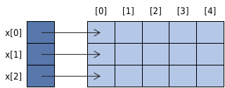

[toc]

# 前言

​		这个文档是我后面学习数据结构与算法的内容笔记。 其中应该包含重要概念、重要知识点、代码段以及相关疑问等等，使用的书为**《数据结构、算法与应用（C++语言描述）》（原书第二版）**。


# 第一章 C++回顾

## 函数与参数

### 参数

1.   **传值参数**

     ```c++
     // 程序 1-1
     int abc(int a, int b, int c){
         return a + b * c;
     }
     
     z = abc(2, x, y);
     ```

     在程序 1-1中, a, b和c都是函数`abc`的**形参(formal parameter)**. 2, x, y是分别与a, b, c对应的**实参(actual paramater)**. 形参a, b, c实际上是**<font color=blue>传值参数(value parameter)</font>**. 在运行时, 函数`abc`执行前, 把实参复制给形参, 复制过程是由形参类型的**复制构造函数(copy constructor)**来完成的.

2.   **引用参数**

     ```c++
     // 程序 1-2
     template <class T>
     T abc(T& a, T& b, T& c){
     	return a + b + c;
     }
     
     z = abc(x, y, z);
     ```

     在程序 1-2中, a, b, c是**<font color=blue>引用参数(reference parameter)</font>**. 实参x, y, z分别是a, b, c的别名, 也就是在`abc`执行期间, 名字x, y, z分别代替了名字a, b, c. 与传值参数的情况不同, 当函数被调用时没有复制实参的值, 在函数返回时没有调用析构函数.

3.   **常量引用**

     **<font color=blue>常量引用(const reference)</font>**指明的引用参数不能被函数修改. 例如在程序 1-2中如果不想更改传入参数的值, 可以重写这段代码:

     ```c++
     // 程序 1-3
     template <class T>
     T abc(const T& a, const T& b, const T& c){
     	return a + b + c;
     }
     
     z = abc(x, y, z);
     ```

     另外, 程序 1-3更通用的[程序](./0001-C++_Review/001-Function_And_Parameters/0005-Template_Function_Plus.cpp)如下:

     ```c++
     // 程序 1-4
     template <class Ta, class Tb, class Tc>
     Ta abc(const Ta& a, const Tb& b, const Tc& c){
     	return a + b + c;
     }
     
     z = abc(x, y, z);
     ```


### [返回值](./0001-C++_Review/001-Function_And_Parameters/0006-Reference_Return.cpp)

因为函数所计算出的表达式结果被存在一个局部的临时变量中, 当函数结束时这个临时变量(以及所有其他的临时变量, 局部变量, 传值参数)所占用的空间将被释放, 其值也不再有效. 

1.   **引用返回**

     给函数的返回类型增加一个后缀**`&`**, 这就是一个**<font color=blue>引用返回(reference return)</font>**. 这种可以放在等号左边给其赋值.

2.   **const型引用返回**

     如果把关键字**`const`**加在引用返回的函数头上,就得到了**<font color=blue>const引用返回(const reference return)</font>**. const型引用返回无法改变返回值内容. 调用此类型的函数时, 必须在返回调用环境前将值赋给const常量.

### 重载函数

一个函数的**签名(signature)**是由这个函数的*形参类型以及形参个数*确定的. 定义多个同名函数的机制称为**<font color=blue>函数重载(function overloading)</font>**. 例如程序[`0006-Reference_Return.cpp`](./0001-C++_Review/001-Function_And_Parameters/0006-Reference_Return.cpp)中`setvalue`就重载了.


## 异常

### [抛出异常](./0001-C++_Review/002-Exception/0001-Throw_Exception.cpp)

可以编写这样的C++程序, 可以对一些异常情况进行检查. 而且当检查出一个异常时,就抛出异常.

```c++
// 程序 1-5
template <class T>
T abc(T a, T b, T c){
	if (c <= 0) {
		throw "The first parameter is less than or equal to 0";
	}
	return (a + b) / c;
}
```

### [处理异常](./0001-C++_Review/002-Exception/0002-Handle_Exception.cpp)

异常的处理使用**`try-catch`**模式, `try`获取异常, `catch`处理异常. 例如程序 1-6:

```c++
// 程序 1-6
// 捕捉到异常后不会在try中继续往下执行, 直接跳转到catch中
try {
	...
} catch ( /* 异常类型-1 */ ) {
	...
} catch ( /* 异常类型-2 */ ) {
	...
}
```


## 动态存储空间分配

### 操作符new

C++操作符**`new`**用来进行动态存储分配或运行是存储分配, 它的值**是一个指针, 指向所分配的空间.**

>   例如, 要给一个整数动态分配存储空间, 必须利用下面的语句生命一个整型指针变量(例如`y`):
>
>   ```c++
>   int *y;
>   ```
>
>   当程序需要这个整数时, 就是用下面的语句为这个整数动态分配存储空间:
>
>   ```c++
>   y = new int;
>   ```
>
>   **操作符`new`分配了一块能够存储一个整数的空间, 并<font color=black>将该空间的指针赋值给`y`, `y`是对整数指针的引用, 而`*y`是对整数本身的引用.</font>** 要在动态分配的空间中存储一个整数值, 可以使用下面的语句:
>
>   ```c++
>   *y = 10;
>   ```
>
>   ---
>
>   以上三个步骤(声明y, 动态存储分配, 为*y赋值)合并为下面的形式:
>
>   ```c++
>   // 形式 1
>   int *y = new int;
>   *y = 10;
>   
>   // 形式 2
>   int *y = new int(10);
>   
>   // 形式 3
>   int *y;
>   y = new int(10);
>   ```

### 一维数组

为了在运行是创建一个一维浮点型数组`x`, 必须把`x`声明为一个浮点型指针, 然后维数组分配足够的空间.

>例如, 一个长度为n的一维浮点数组可以按照以下方式来创建:
>
>```c++
>float *x = new float[n];
>```
>
>操作符`new`为n个浮点数分配了存储空间, 并**返回第一个浮点数空间的指针**.

### new异常处理

执行语句`float *x = new float[n]`可能会出现这样的情况: 对n个浮点数计算机==没有足够的内存可以分配==. 在这样的情况下==`new`也不会分配内存==, 而是==抛出一个类型为`bad_alloc`的异常==. 

```c++
// 程序 1-7
float *x;
try {
	x = new float[10000000000];
} catch (bad_alloc e){
	cerr << "Out of memory" << endl;
	exit(1);
}
```

### 操作符delete

动态分配的存储空间不再需要时应该把它释放. 释放的空间可重新用来动态分配. 操作符`delete`用来释放由操作符`new`所分配的空间.

```c++
// 程序 1-8
int *y = new int(10);
delete y;

float *x = new float[10];
delete []x;
// Or
// delete x;
```

### 二维数组

1.   **如果数组编译时列数已知**, 可以采用下面的语法来动态分配存储空间:

     ```c++
     // 程序 1-9
     char (*c) [5];
     try {
     	c = new char[n][5];
     } catch (bad_alloc e){
     	cerr << "Out of memory" << endl;
     	exit(1);
     }
     ```

     在运行时, 这种数组的行数n要么通过计算来确定, 要么由用户通过输入来指定. 

2.   **如果数组编译时列数未知**, 那么不可能仅调用一次new就能创建这个二维数组(即使数组的行数在编译时已知). 要构造这样的二维数组, 可以把它看作是由若干行所构成的结构, 每一行都是一个能用new来创建的一维数组. 指向每一行的指针保存在另外一个一维数组之中.

     >   如下图建立了一个3×5数组x所需要的结构:
     >
     >   
     >
     >   <center>图 1-1 一个3×5数组的存储结构</center>
     >
     >   x[0], x[1]和x[2]分别指向第0行, 第1行和第2行的<font color=black>**首元素**</font>. 如果x是一个字符数组, 那么x[0:2]是指向字符的指针, 而x本身是指向指针的指针, x的生命语法如下所示:
     >
     >   ```c++
     >   char **x;
     >   ```

     程序 1-10创建了如图 1-1所示的存储结构. 该程序创建一个类型为T的二维数组. 程序首先为**指针**x[0], ..., x[numberOfRows]申请空间. 然后为数组的每一行申请空间.

     ```c++
     // 程序 1-10 为一个二维数组分配存储空间
     template <class T>
     bool make2dArray(T ** &x, int numberOfRows, int numberOfColumns) {
     	try {
     		// 创建行指针
     		x = new T * [numberOfRows];
     
     		// 为每一行分配空间
     		for (int i = 0; i < numberOfRows; i++) {
     			x[i] = new int [numberOfColumns];
     		}
     		return true;
     	} catch(bad_alloc) {
     		return false;
     	}
     }
     ```

     程序 1-11中函数**`make2dArray`**在异常出现时可以什么都不做, **调用者可以捕获**操作符new抛出的任何异常.

     ```c++
     // 程序 1-11 创建一个二维数组, 没有异常处理
     template <class T>
     void make2dArray(T ** &x, int numberOfRows, int numberOfColumns) {
     	// 创建行指针
     	x = new T * [numberOfRows];
     
     	// 为每一行分配空间
     	for (int i = 0; i < numberOfRows; i++)
     	{
     		x[i] = new int [numberOfColumns];
     	}
     }
     
     try {
     	make2dArray(a, 3, 5);
     	cout << "Successfully created array." << endl;
     } catch (bad_alloc) {
     	cerr << "Failed to create array." << endl;
     	exit(1);
     }
     ```

3.   **释放在函数`make2Array`中分配的空间**. 分为两步来释放程序 1-10的二维数组空间. 

     -   释放在for循环中为每一行所分配的空间
     -   释放为行指针所分配的空间

     ```c++
     template <class T>
     void delete2dArray(T ** &x, int numberOfRows) {
     	for (int i = 0; i < numberOfRows; i++) {
     		delete [] x[i];
     	}
     
     	delete [] x;
     	x = NULL;	// 防止用户继续访问已被释放的空间
     }
     ```


## 自有数据类型

### 类currency

定义自有数据类型最灵活的方式就是使用C++的类(class)结构. [`点击此处查看定义的类currency的代码.`](./0001-C++_Review/004-Own_Data_Type/0001-Class_currency.cpp)

成员函数`getSign`, `getDollars`, `getCents`返回调用对象的相应数据成员, 关键字**`const`**指明**这些函数不会改变调用对象的值**. 这种函数成为**<font color=blue>常量函数(constant function)</font>**.

>   -   成员函数`add`把调用对象的货币值与参数对象(即作为参数的currency类对象)的货币值相加, 然后返回相加后的结果. 因为这个成员函数不会改变调用对象的值, 所以他是一个常量函数.
>
>   -   成员函数`increment`把参数对象的货币之加到调用对象上, 这个函数改变了调用对象的值, 因此它不是一个常量函数.
>
>   -   最后一个成员函数`output`把调用对象插入输出流cout中来显示它的值, 不会改变调用对象, 因此是个常量函数.

成员函数如果不在类声明体内部实现, 而在外部实现, 就必须使用**<font color=blue>作用域说明符(scope resolution operator) `::` </font>**以指明该函数是currency类的成员函数.

类currency的数据成员已经设为私有(private), 类的用户不能直接访问这些成员. 因此用户通过对象直接改变私有数据成员的值是允许的.

```c++
h.cents = 20;
h.dollars = 100;
h.sign = plus;
```

### 类currency另一种描述方法

假设已经有许多应用程序采用了上面例子中的currency类, 现在我们想要修改对currency类对象的数据描述, 是应用最多的两个成员函数`add`和`increment`运行更快, 进而提高应用程序的执行速度.

<font color=red style="background: yellow">**因为用户仅仅通过共有部分所提供的接口与currency类进行交互, 所以对私有部分的修改不会影响程序的正确性.**</font> 因此私有部分修改, 而应用程序不用修改. [`点击此处查看另一种方式实现类currency的代码.`](./0001-C++_Review/004-Own_Data_Type/0002-Class_currency_another.cpp)

### 操作符重载

上面currency类的成员函数`add`和`increment`分别实现的是+和+=的功能. 为了使用这些操作符, 可以进行<font color=blue>**操作符重载(operator overloading)**</font>. 以及重载c++的流插入操作符`<<`. [`本节对应代码点击此处查看.`](./0001-C++_Review/004-Own_Data_Type/0003-Class_currency_Overloading.cpp)

`+`与`+=`在类内进行操作符重载, 可以直接访问私有成员`amount`, 但是`<<`在类外进行重载, 不属于类currency的成员, 所以不能直接进行类似于`x.amount`的操作, 所以在重载`<<`时调用函数`output`进行辅助.

### 友元和保护性类成员

在一些程序中，我们需要**给予别的类和函数直接访问该类私有成员的权利**, 这就需要把这些类和函数声明为该类的<font color=blue>**友元(friend)**</font>.

在程序[`0003-Class_currency_Overloading.cpp`](./0001-C++_Review/004-Own_Data_Type/0002-Class_currency_another.cpp)中为了对操作符`<<`重载, 定义了成员函数output间接访问私有数据成员amount. 如果把`ostream& operator<<`声明为currency类的友元, 它就可以直接访问currency类的所有成员. 这时就不需要另外定义成员函数`output`. 

***为了格式统一, friend语句总是紧跟在类标题语句之后:***

```c++
class currency{
    friend ostream& operator<<(ostream&, constCurrency&);
public:
    ....
}
```


## 异常类illegalParametetValue

程序 1-12是**用户自定义**的一个类`illegalParameterValue`. 当一个函数的实参值无意义时, 要抛出的异常就是这个类型. 程序 1-13是程序 1-5的另一个版本: 程序 1-13抛出的异常类型是`illegalParameterValue`, 而程序 1-5抛出的异常类型是`const char*`. 程序 1-14显示的是如何捕获illegalParameterValue类型的异常.

```c++
// 程序 1-12
class illegalParameterValue {
public:
    illegalParameterValue():
        message("illegal parameter value"){}
    illegalParameterValue(string theMessage) {
    // illegalParameterValue(const char* theMessage) {
        message = theMessage;
    }
    void outputMessage() { cout << message << endl; }
private:
    string message;
    // const char* message
};
```

```c++
// 程序 1-13
template <class T>
T abc(T a, T b, T c){
    if (c <= 0) {
        throw illegalParameterValue("The first parameter is less than or equal to 0");
    }
    return (a + b) / c;
}
```

```c++
// 程序 1-14
int main() {
    try {
        abc(1, 2, 0);
    } catch (illegalParameterValue e) {
        e.outputMessage();
    }
    return 0;
}
```


## 递归函数

<font color=blue>**递归函数(recursive function)**</font>或方法自己调用自己. 在<font color=blue>**直接递归(direct recursion)**</font>中, 递归函数f的代码包含了调用f的语句. <font color=blue>**间接递归(indirect recursion)**</font>中, 递归函数f调用了函数g, g又调用了h...如此进行下去直到又调用了f. 

### 递归的数学函数

数学中经常有这样的函数: 自己定义自己. 例如, n的阶乘函数 *f(n)=n!* , n为整数:
$$
f(n) = 
\begin{cases}
1\ \ \ \ \ \ \ \ \ \ \ \ \ \ \ ,\ n\le1\\
nf(n-1),\ n>0\\
\end{cases}
$$
假定 *f(n)* 是直接递归的, 要使函数 *f(n)* 的递归定义有一个完全的形式, 需要满足以下条件:

-   有一个<font color=blue>**基础部分(base component)**</font>, 它包含 *n* 的一个或多个值, 对这些值, *f(n)* 是直接定义的(也就是不用递归就能求解).
-   另一个<font color=blue>**递归部分(recursive component)**</font>, 右侧 *f*有一个参数小于 *n* ,因此重复应用递归部分可以把右侧 *f* 的表达式转换为基础部分.

另一个例子是**斐波那契数列**:
$$
F_0 = 0, F_1 = 1, F_n = F_{n-1} + F_{n-2}\ \ (n>1)
$$
其中, *F<sub>0</sub> = 0* 和 *F<sub>1</sub> = 1* 是基础部分, *F<sub>n</sub> = F<sub>n-1</sub> + F<sub>n-2</sub>* 是递归部分.

### 归纳

有关递归函数的第二个概念: **归纳证明**. 尝试证明下列公式:
$$
\sum^n_{i=0}=\frac{n(n+1)}{2}\ \ n\ge0
$$
<b><sub>这点就不证明了.</sub></b> 这种证明方法有三个部分: <font color=blue>**归纳基础(induction base)**</font>, <font color=blue>**归纳假设(induction hypothesis)**</font>和<font color=blue>**归纳步骤(induction step)**</font>.

### C++递归函数

使用C++编写递归函数==<font color=red>**必须包含基础部分.**</font>== 每次递归调用, 其参数值都比上一次的参数值要小, 从而重复调用递归函数使参数值达到基础部分的值.

```c++
// 程序 1-15
// 计算n的阶乘
int factorial(int n) {
    return (n == 1) ? 1 : (n * factorial(n - 1));
}
```

```c++
// 程序 1-16
// 模板函数sum对数组元素a[0]~a[n-1](简记为a[0:n-1])求和, 当n=0时， 函数返回值是0.
// 普通叠加
template<class T>
T sum(T a[], int n) {
    T theSum = 0;
    for (int i = 0; i < n; i++)
        theSum += a[i];
    return theSum;
}
```

```c++
// 程序 1-17
// 模板函数sum对数组元素a[0]~a[n-1](简记为a[0:n-1])求和, 当n=0时， 函数返回值是0.
// 使用递归
template<class T>
T sum(T a[], int n) {
        return  n > 0 ? sum(a, n - 1) + a[n - 1] : 0;
}
```

```c++
// 程序 1-18
// 排列, 输出n个元素的所有排列组合
static int K = 0;

template<class T>
void swap(T &a, T &b) {
    T temp;
    temp = a;
    a = b;
    b = temp;
}

template<class T>
void permutation(T list[], int k, int m) {
    if (k == m) {
        // 书上的程序在这里没有K, 只能输出0~m的所有排列;
        // 带上了之后就正常了
        copy(list + K, list + m + 1, ostream_iterator<T>(cout, ""));
        cout << endl;
    } else {
        for (int i = k; i <= m; i++)
        {
            ::swap(list[k], list[i]);	// 标准库中也有swap, 所以这里带上::
            permutation(list, k + 1, m);
            ::swap(list[k], list[i]);
        }
    }
}

int main(int argc, char const *argv[]) {
    int a[10] = {0, 1, 2, 3};
    K = 1;
    permutation(a, K, 3);
    return 0;
}
```


## 标准模板库(STL)

<font color=blue>**C++标准模板库(STL)**</font>是一个容器, 适配器, 迭代器, 函数对象(也称仿函数)和算法的集合. 有效使用STL, 应用程序的设计会简单许多.

### STL 算法 accumulate

这个算法是对顺序表元素顺序累计求和, 它的语法是
$$
accumulate(start,\ end,\ initialValue)
$$
其中, start指向首元素, ==**end指向尾元素的下一个位置**==. 调用语句是`accumulate(a, a+n, initialValue)`, a是一个一维数组, 返回值是
$$
initialValue\ +\ \sum^{n-1}_{i=0}a[i]
$$
可以查看程序[`0001_STL_accumulate.cpp`](./0001-C++_Review/007_STL/0001_STL_accumulate.cpp)

```c++
// 程序 1-19
// 设计了模板函数, 对书上的代码有一点优化·
template<class T>
T sum(T a[], int n, T initialValue = 0) {
    return accumulate(a, a+n, initialValue);    // 返回数组a[0：n-1]的累积和 + initialValue
}
```

STL算法accumulate还有一个更通用的形式，语法如下
$$
accumulate(start,\ end,\ initialValue,\ operator)
$$
其中, `operator`是一个函数, 他规定了在累计过程中的操作, 例如, 利用STL的函数对象`multipllies`能够计算数组元素的乘积. 可查看程序[`0002_STL_accumulate_multiplies.cpp`](./0001-C++_Review/007_STL/0002_STL_accumulate_multiplies.cpp)

```c++
// 程序 1-20
template<class T>
T product(T a[], int n, T initialValue = 1) {
    // 返回数组a[0：n-1]的累积乘积 x initialValue
    return accumulate(a, a+n, initialValue, multiplies<T>());
}
```

### STL算法copy和next_permutation

**算法copy**把顺序表的元素从一个位置复制到另一个位置. 语法是
$$
copy(start,\ end,\ to)
$$
其中`to`给出了第一个元素要复制到的位置. 因此, **元素从位置start, start+1, ... , end-1依次复制到to, to+1, ... , to+end-start.**

算法next_permutation语法是
$$
next\_permutation(start,\ end)
$$
另外还有一种用法是
$$
next\_permutation(start,\ end,\ compare)
$$
函数compare用来判定一个排列是否比另一个排列要小, 而在两个参数的版本中, 比较操作符是由<来执行的.

对范围内[start, end)内的元素, **按字典顺序产生下一个更大的排列.** 当且仅当这个排列存在时, 返回值为true

```c++
// 程序 1-21
// 输出下一个更大的序列
template<class T>
void permutations(T list[], int k, int m) {
    do {
        copy(list + k, list + m, ostream_iterator<T>(cout, ""));
        cout << endl;
    } while (next_permutation(list + k, list + m));
}
```

另外, 还有个类似的函数是`prev_permutation`, 生成的是下一个等于或小于当前顺序的排序. 参考[`0005_STL_next_permutation_change_order.cpp`](./0001-C++_Review/007_STL/0005_STL_next_permutation_change_order.cpp)

其他一些常用的STL算法可以[点击此处查看](http://c.biancheng.net/stl/algorithms/).


# 附录

## 中英文对照表

### 文件名自译部分

| 中文             | 英文                           |
| ---------------- | ------------------------------ |
| 模板函数         | Template_Function              |
| 结构体操作符重载 | Structure_Operator_Overloading |
| 引用参数         | Reference_Parameter            |
| 常量引用         | Const_Reference                |
| 引用返回         | Reference_Return               |
| 抛出异常         | Throw_Exception                |
| 处理异常         | Handle_Exception               |


## 小想法

**2021/11/10**

>   上班回家, 女朋友还在上课. emmmm.... 玩儿游戏的话键盘鼠标噼里啪啦, 算了, 看看书啥的吧.

**2021/11/14**

>   距离女朋友下课还有半个小时, 看一会儿再买饭.

**2021/12/7**

>   挺晚的了, 先把currency这个类写完, 具体实现周六周日再学习.

**2021/12/11**

>   竟然没有心情玩儿游戏, 提交完这一笔就去女朋友那儿玩儿去哈哈哈哈或或或或或或或或

**2021/12/12**

>   双十二竟然没有什么想买的...学习学习

**2021/12/18**

>   不想上班【痛苦面具】

**2022/1/9**

>   20天没写了, 梦想? 生活? 我在干嘛?
